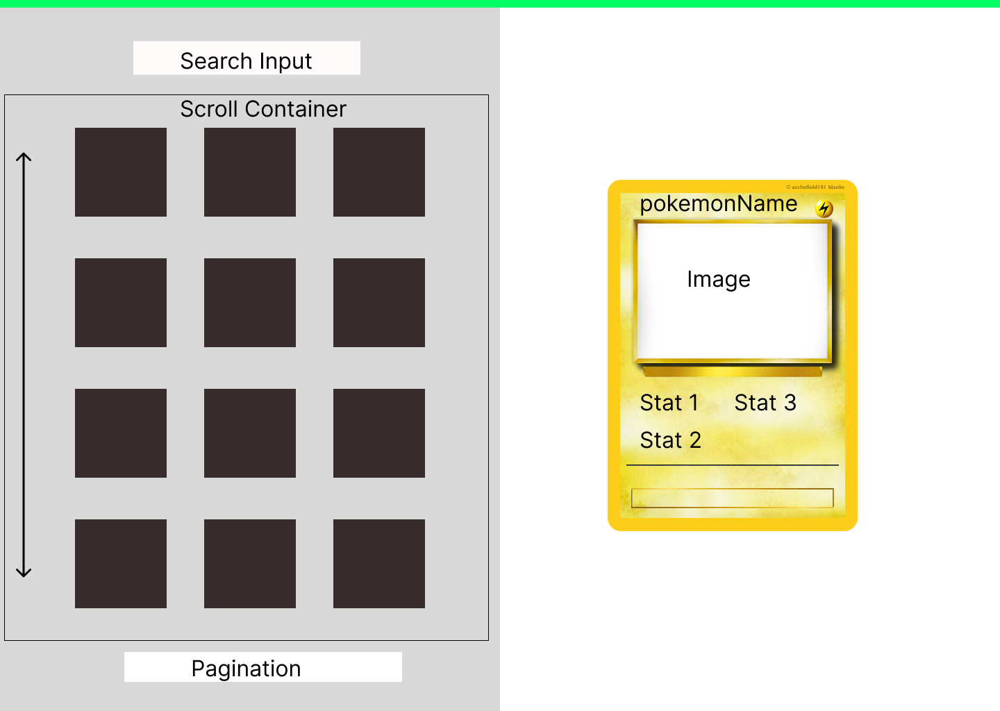

before Starting:

## Techstack:

- Next.js (npx create-next-app@latest)
- Typescript
- Mantine UI as Component Library (Pagination and Inputs)
- Page Layout custom css, next.js css modules
- fetch for requests

## Min-requirements

- List => index Page, index.js
- Detail Page => dynamic Page, [pokemonName]
- Pagination (can get tricky with pre-rendering)
- reusable code for the request
- own feature branch, dont push on master
- I will use the next.js starter porject as foundation

## Problems I see from now:

- I actually want to put the list and the Detail Page on one Page
  so index.js and [pokemonName] should be on one page. I am
  not really sure how to do that with next.js because it is not the recomended way
- styling will take to long => keep for the end, having this effect on a Detail Card or rendering the details in this was would be aweseome https://poke-holo.simey.me/, but is not required
- I will keep types to a minimum, just for the GET request, more if there is still time
- No big error handling
- Stuff that I come up during develompent I will just put in a comment if not nessacary

## Optional-requirement:

- Search can be done with a autocomplete from ManintUI and the input can be handled with
  debounce from lodash, trim() and min-3 length will be just handled by react, no visual feedback

Project wont be responsible

## 

---

Progress:
